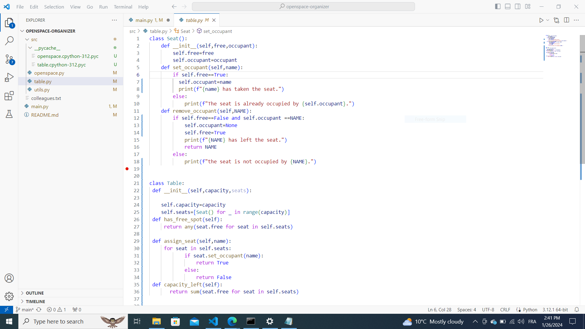
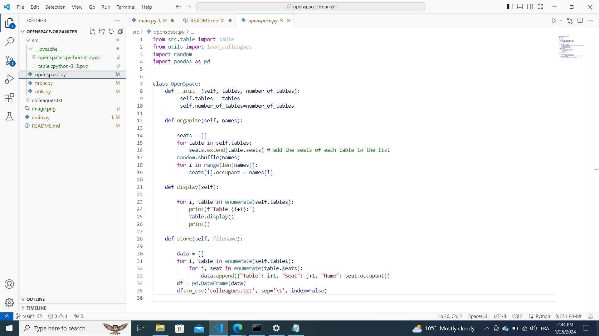

Description:
This project is about making a python script about the sitting arrangements of the employees of a company who recently shifted to a new office and has given an open space having six tables each having four seats.Some of the employees are new so they want to change the seat and neighbour every day to know their colleagues better.
So the main idea is to shuffle the sitting arrangements everyday.
                     

                               Seems interesting!!!

Installation:
VS code
Panda library

Usage:
This python code is stored in as openspace organiser repository in public mode so that anybody can read it.
Here is the link below:
https://github.com/jyotisharma513/openspace-organizer1

Images:

